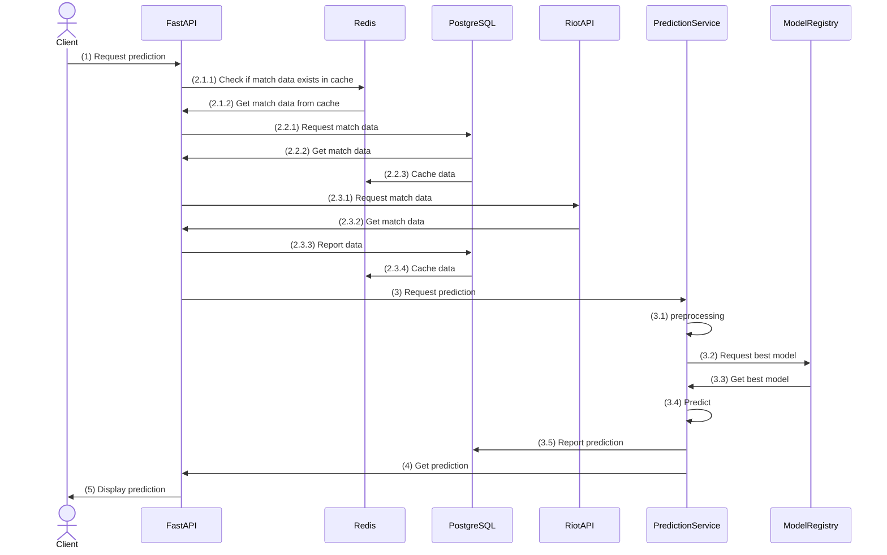
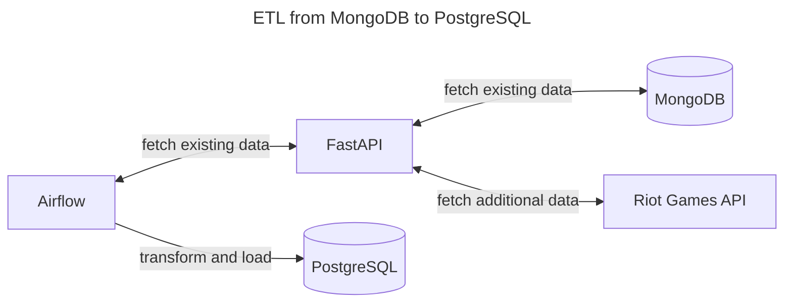

# nitz

nitz is an application designed to help League of Legends (LoL) players to understand their current match state in real time.

Initially, the project started with Overwatch 2, but since Blizzard don't share match data, unfortunately, we decided to move forward with other candidates.

We are two Computer Science students who like gaming, math and code. 

Our goal is to give real time insights to players using Maching Learning (ML) and statistical analyses during their matches. This allows for better decision makings during games, and hopefully, better results.

Our course of actions is as follows:

- Get the backend working. Creating an API to fetch and store match data for later use (for developing the ML models). This includes developing the API, scheduling ETL processes and getting the databases up and running.
- After that, we'll be working on the ML and statistical models.
- In parallel, we'll be developing the frontend for users to be able to use the application.
- Lastly, hosting the backend on the cloud.

As for the architecture of the application, we've separated it into 2 main flows:

1. Inference

2. Data gathering and ETL processes.

